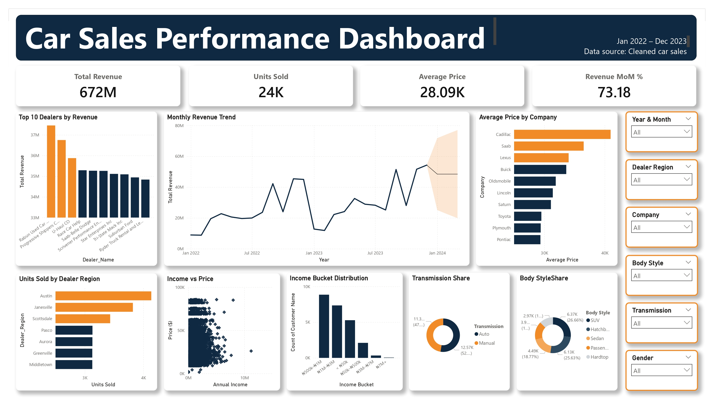
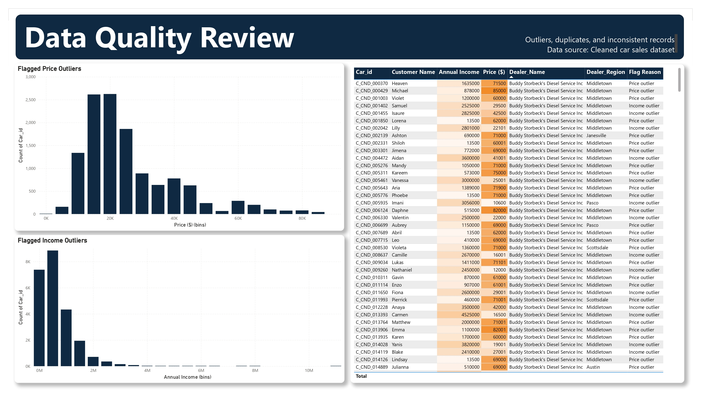

# Car Sales Data Analysis and Business Insights

## Overview
This project presents an end-to-end analysis of a car sales dataset using Python, Jupyter Notebook, and Power BI. The workflow covers data cleaning, preprocessing, exploratory data analysis, customer segmentation, pricing analysis, anomaly detection, and dashboard development.
The objective was to transform raw transactional data into a structured analytical workflow capable of generating actionable business insights across dealer performance, regional sales, pricing behaviour, customer affordability, and product demand.

## Objectives
* Clean and prepare raw car sales data for analysis
* Analyse sales performance across dealers and regions
* Identify monthly sales trends and seasonality patterns
* Explore pricing distributions across companies and models
* Segment customers using annual income and purchasing behaviour
* Detect data anomalies and inconsistent records
* Design an interactive Power BI dashboard for reporting and monitoring

## Tools and Technologies
* Python
* Pandas
* Jupyter Notebook
* Power BI
* Excel

## Dataset Overview
The dataset contains transactional car sales records with fields including:
* Transaction dates
* Dealer and regional information
* Customer demographics
* Company and model details
* Vehicle specifications
* Pricing information
* Income distribution data

Sensitive fields such as phone numbers were removed before publishing this repository.

## Analytical Workflow
### 1. Data Cleaning and Preparation
The raw dataset was cleaned and transformed in Jupyter Notebook using Pandas. Key preprocessing steps included:
* Handling missing values
* Standardising column formats
* Correcting inconsistent labels
* Removing unnecessary fields
The cleaned dataset was exported for dashboard development in Power BI.

### 2. Exploratory Data Analysis
The analysis focused on:
* Dealer and regional sales performance
* Monthly revenue trends
* Product and model popularity
* Customer affordability patterns
* Price distributions across brands and body styles
* Feature preference analysis
* Anomaly detection and data quality checks

### 3. Dashboard Development
An interactive Power BI dashboard was developed to support business monitoring and decision-making.
The dashboard includes:
* Revenue KPIs
* Dealer and regional performance analysis
* Monthly revenue trend analysis
* Customer income segmentation
* Pricing analysis
* Model popularity tracking
* Feature preference breakdowns
* Data quality review and anomaly detection

## Key Insights
* Sales performance varied significantly across dealers and regions.
* Certain companies and models consistently generated higher revenue and sales volume.
* Monthly revenue trends revealed fluctuations in sales activity over time.
* Customer income segmentation highlighted distinct affordability groups.
* Pricing patterns differed considerably across body styles and manufacturers.
* Data quality checks identified missing values, duplicate records, and statistical outliers.

## Repository Structure

```text
Car-Sales-Data-Analysis-and-Business-Insights/
│
├── data/
│   └── car_sales_clean.csv
│
├── notebooks/
│   └── CarSalesData.ipynb
│
├── powerbi/
│   └── CarSalesDashboard.pbix
│
├── images/
│   ├── Dashboard_page1.jpg
│   └── Dashboard_page2.jpg
│
├── exports/
│   └── CarSalesDashboard.pdf
│
└── README.md
```

## Dashboard Preview
### Main Dashboard


### Data Quality Review


## Files Included
### `car_sales_clean.csv`
Cleaned analytical dataset used for reporting and dashboard development.

### `CarSalesData.ipynb`
Jupyter Notebook containing:
* Data loading
* Cleaning
* Transformation
* Exploratory analysis

### `CarSalesDashboard.pbix`
Interactive Power BI dashboard file.

### `CarSalesDashboard.pdf`
Exported dashboard report.

## Data Quality and Anomaly Detection
The project includes a dedicated data quality review process using rule-based anomaly detection techniques.
Checks performed include:
* Missing customer information
* Income outlier detection
* Price outlier detection
Outliers were identified using statistical threshold methods based on interquartile range (IQR).

## How to Use
### Jupyter Notebook
Open:
```text
notebooks/CarSalesData.ipynb
```
to review the cleaning and preprocessing workflow.

### Power BI Dashboard
Open:
```text
powerbi/CarSalesDashboard.pbix
```
to interact with the dashboard and visualisations.

## Conclusion
This project demonstrates a complete business intelligence workflow, from raw data preparation to dashboard-based insight generation. The analysis combines statistical exploration, business reporting, and interactive visualisation to support data-driven decision-making in a car sales environment.
